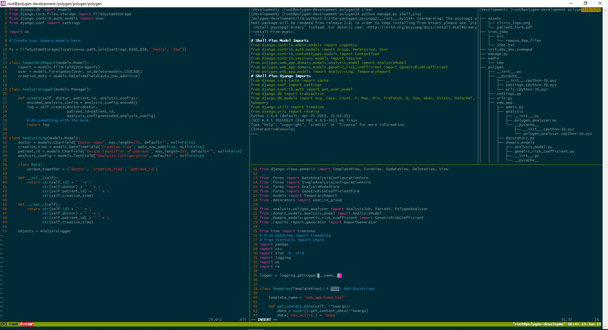

```{r setup, include=FALSE}
options(
  htmltools.dir.version = FALSE,
  servr.host = '0.0.0.0',
  servr.daemon = TRUE
        )

library(tidyverse)
```

```{r xaringan-themer, include=FALSE}
library(xaringanthemer)
solarized_dark(
  code_font_family = "Fira Code",
  code_font_url    = "https://cdn.rawgit.com/tonsky/FiraCode/1.204/distr/fira_code.css"
)
```

.toc[
# The story so far...

## What's this all about?
#### Elevator Pitch (and a few definitions)
#### Project Summary
<!-- #### What is a SNP? -->
<!-- #### Who is this "James" guy anyway?  -->

## Which SNPs and Why?
### Trawling through the GWAS Catalog 

## Polygen 
### How are you going to do this anyway?
]

---

class: inverse

# Elevator Pitch

### Problem: 
> &raquo; Cancer causes billions of dollars in health burden to the health system.

- Annual cancer burden *~65,000 diagnoses, ~12,500 deaths*
  + Breast, Colorectal & Prostate cancer + Melanoma
- Current estimation of cancer risk methods are Blunt/Inadequate 
  + Most affected individuals have no significant FHx
  
### Proposed Solution: 
> &raquo; Personalised Genomic Risk Assessment Platform

- Roadmap to a cost-effective reduction in cancer-related disease burden.

- Personalised screening recommendations
    + Identify high-risk individuals through **SNP Genotyping**
    + Precise estimation of **Polygenic Risk (PRS)**
    + (and guidelines for its interpretation)
---

# What are these acronyms?

### SNP - Single Nucleotide Polymorphism

- Common genomic variation contributes to cancer risk.

- Individual SNPs contribute a near-negiligible risk.

- Combined risk-contribution may be greater than any other single factor.


### PRS - Polygenic Risk Score 

- Quantifies combined SNP-associated risk

- Various derivation methods

- Demonstrated ability to improve performance of existing risk assessment methods


---
class: inverse

# VCCC Precision Medicine Grant 

> The development of a VCCC platform to assess the genomic risk of multiple cancers - towards the precision prevention of cancer

<br>
```{r pillars,  dev='svg', eval=TRUE, include=FALSE}
data <- tibble(
    pillar = c("Sequence",
               "Interpret",
               "Report"),
    val = c(1,1,1)
) %>% 
   mutate(pillar=factor(pillar, levels=pillar, ordered = TRUE)) 

ggplot(
    data = data,
    aes(x=pillar, y=val, fill=pillar)
) +
    geom_bar(stat='identity') +
    labs(x=NULL, y=NULL) +
    # ggtitle("Three Pillars") +
    theme(
        plot.title = element_text(size=30, family = 'Serif', hjust=0.5),
        axis.text.y = element_blank(),
        axis.text.x = element_text(size=30),
        axis.ticks = element_blank(),
        panel.background = element_rect(fill = '#fdf6e3', colour = '#fdf6e3'),
        plot.background = element_rect(fill = '#fdf6e3', colour = '#fdf6e3'),
        legend.position = 'none'
    )

ggsave('presentation_files/figure-html/pillars-1.svg')
```


.project-pillars-left[
### Project Pillars
<br>
* Flexible Genotyping Platform

<br>
* Standard guidelines for interpretation

<br>
* Integrating PRS into the existing risk management landscape
]

.project-pillars-right[
```{r pillars-display, echo=FALSE, out.width='100%'}
knitr::include_graphics('presentation_files/figure-html/pillars-1.svg', dpi = NA)
```
]

---
class: inverse

# VCCC Precision Medicine Grant: Sequencing 
## Developing an optimal Genomic Risk platform

.platform-left[

### 1. Establish a research platform 
Custom Illumina Microarray Chip 
- 270,000 SNP Core

Plus 600,000 SNPs identified by OncoArray Network contributors: 

<ul>
    <li title="Genetic Associations and Mechanisms in Oncology">GAME-ON</li>
    <li title="Breast Cancer Association Consortium">BCAC</li>
    <li title="Ovarian Cancer Association Consortium">OCAC</li>
    <li title="Consortium of Investigators of Modifiers of BRCA1/2">CIMBA</li>
</ul>

.img-infinium[]

]


.platform-right[

### 2. Assess requirements for clinical accreditation 

<br><br>

]

---

class: inverse

# VCCC Precision Medicine Grant: Interpretation
## Standardising Polygenic Risk Assessment

.mcmahon-left[
.mcmahon-meme[

<p>BRCA Plus Panel</p><br />
]
]

.mcmahon-right[
.mcmahon-meme[

<p>77 SNP Breast Score (2015)<sup>1</sup></p>
<p>0.619&lt;AUC&lt;0.627</p>
]
]

.mcmahon-left[
.mcmahon-meme[

<p>313 SNP Breast & Subtype Score (2018)<sup>2</sup></p>
<p>0.628&lt;AUC&lt;0.651</p>
]
]

.mcmahon-right[
.mcmahon-meme[

<p>Clinically valid multi-cancer PRS informing management of high-risk variants & lifestyle factors (<em>2023?</em>)</p>
]
]

---

# Polygen
<a href="http://115.146.85.122/"></a>

---

# References

.footnote[
[1] Mavaddat <em>et al.</em> (2015) Prediction of breast cancer risk based on profiling with common genetic variants. J Natl Cancer Inst. 2015 Apr 8;107(5). Available from: https://doi.org/10.1093/jnci/djv036. Print 2015 May.

[2] Mavaddat <em>et al.</em> Polygenic Risk Scores for Prediction of Breast Cancer and Breast Cancer Subtypes. AJHG. 2019;104(1):21–34. Available from: https://doi.org/10.1016/j.ajhg.2018.11.002
]

